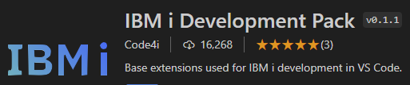
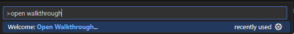
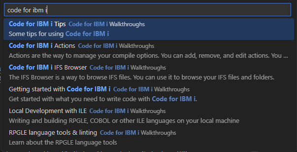
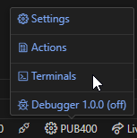
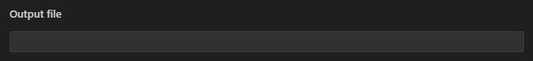
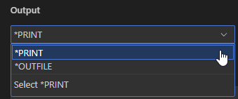

# An IBM i developer's journey in the land of VS Code
This is the landing page that will help you get started with IBM i development within VS Code.

# Prerequisites
- VS Code must be installed: [get it here!](https://code.visualstudio.com/download)
- You must have a PUB400 profile: [signup here](https://pub400.com/cgi/signup.nd/start)

# Get started
Open VS Code and follow each steps carefully.

# 1. Install the IBM i Development pack


This is a set of extensions to get you started with IBM i development within VS Code. It includes Code for IBM i, DB2 for IBM i, RPG/CL/COBOL highlighting and a few other features.

[Click here to install it](vscode:extension/HalcyonTechLtd.ibm-i-development-pack)

# 2. Open the walkthroughs
There are 6 walkthroughs that are provided by Code for IBM i to help you get started with IBM i development within VS Code.

To open a walkthrough, follow these steps
1. Press F1
2. In the command palette, type `open walkthrough` and click on Welcome: `Open Walkthrough...`

3. Filter out the walkthrough by typing `code for ibm i`.

4. Click on a walkthrough to open it and get started

The walkthroughs should be taken in the following order:
## Getting Started with Code for IBM i
Through this walkthrough, you'll learn how to:
- Create a connection
- Connect to an IBM i
- Define an Object Browser filter ([documentation](https://codefori.github.io/docs/browsers/object-browser/))
- Edit source code ([documentation](https://codefori.github.io/docs/developing/editing-compiling/))

### Dive deeper!
- Remote pase Terminal and 5250 emulator can be opened from the bottom status bar



- 

## Code for IBM i IFS Browser
Through this walkthrough, you'll learn how to:
- Browse the IFS
- Open streamfiles
- Change the working directory

### Dive deeper!
Aside from the usual streamfile actions (create/move/copy/delete), the IFS browser offers some useful features:
- Download multiple files or folder (select and right-click)
- Upload from your local file explorer using drag'n'drop
- Move/copy using drag'n'drop
- Compare with various items

## Code for IBM i Actions
Actions in Code for IBM i is a highly customizable feature. It lets you define and run 5250 or shell commands on various items.

Through this walkthrough, you'll learn how to:
- Access the actions
- Create or edit actions
- Run the actions

### Dive deeper!
[Click here](https://codefori.github.io/docs/developing/actions/) to check out the related documentation section.

- Define [command profiles](https://codefori.github.io/docs/settings/profiles) to customize actions execution context
- Each command line starting with `?` will open an input to let you change the command before it gets executed
- You can define you own action prompt, using text fields and dropdown lists!

#### Text field example
Syntax: `PARM(${id|Label})`
```
OUTFILE(${outfile|Output file})
```


#### Dropdown list example
Syntax: `PARM(${id|Label|VALUE1,VALUE2,...})`
```
OUTPUT(${output|Output|*PRINT,*OUTFILE})
```


## RPGLE language tools & linting
Through this walkthrough, you'll learn how to:
- Bring the `Outline` view to focus
- Use content assist
- Configure the linter
- Fix errors reported by the linter

### Dive deeper!
- [Click here](https://codefori.github.io/docs/extensions/rpgle/) to check out the RPG documentation section.
- [Click here](https://codefori.github.io/docs/extensions/rpgle/linter/) to check out the linter documentation.

## Local development with ILE
Through this walkthrough, you'll learn how to:
- Work on a locally hosted IBM i project
- Create local actions set tied to this project
- Use git to manage the project lifecycle

### Dive deeper!
[Click here](https://codefori.github.io/docs/developing/local/getting-started/) to learn more about local IBM i development.

## Code for IBM i Tips
Through this walkthrough, you'll learn how to:
- Compare source editors
- Run SQL using the DB2 for i extension
- Search for source members

### Dive deeper!
[Check out this section](https://codefori.github.io/docs/tips/protect/) to learn more about preventing source code from being modified, using protected modes.