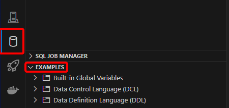
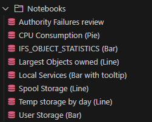

# Le voyage d’un développeur IBM i au pays de VS Code
Ceci est la page d’accueil qui vous aidera à démarrer le développement IBM i dans VS Code.

# Prérequis
- VS Code doit être installé : [téléchargez-le ici !](https://code.visualstudio.com/download)
- Connectez vous à i in the Cloud : [cliquez ici](http://iopen.iinthecloud.com:8080)

# Commencer
Ouvrez VS Code et suivez attentivement chaque étape.

# 1. Installer le pack de développement IBM i


Il s’agit d’un ensemble d’extensions pour vous aider à démarrer le développement IBM i dans VS Code. Il inclut Code for IBM i, DB2 for IBM i, la coloration RPG/CL/COBOL et quelques autres fonctionnalités.

[Cliquez ici pour l’installer](vscode:extension/HalcyonTechLtd.ibm-i-development-pack)

# 2. Ouvrir les _walkthroughs_ (visites guidés) de Code for IBM i
Six _walkthroughs_ sont fournis par Code for IBM i pour vous aider à commencer le développement IBM i dans VS Code.

Pour ouvrir un _walkthrough_, suivez ces étapes
1. Appuyez sur F1
2. Dans la palette de commandes, tapez `open walkthrough` et cliquez sur `Welcome: Open Walkthrough...`

3. Filtrez les _walkthroughs_ en tapant `code for ibm i`.

4. Cliquez sur un _walkthrough_ pour l’ouvrir et commencer

Les _walkthroughs_ doivent être suivis dans l’ordre suivant:
## Getting Started with Code for IBM i
À travers ce _walkthrough_, vous apprendrez à:
- Créer une connexion
- Se connecter à un IBM i
- Définir un filtre dans l’Object Browser ([documentation](https://codefori.github.io/docs/browsers/object-browser/))
- Éditer du code source ([documentation](https://codefori.github.io/docs/developing/editing-compiling/))

### Pour aller plus loin!
- Le terminal Remote PASE et l’émulateur 5250 peuvent être ouverts depuis la barre d’état en bas


- Les paramètres de connexion peuvent aussi être ouverts depuis là.

## Code for IBM i IFS Browser
À travers ce _walkthrough_, vous apprendrez à:
- Parcourir l’IFS
- Ouvrir des streamfiles
- Changer le répertoire de travail

### Pour aller plus loin!
En plus des actions habituelles (créer/move/copy/delete), le navigateur IFS offre des fonctionnalités utiles:
- Télécharger plusieurs fichiers ou dossiers (sélectionner puis clic droit)
- Importer depuis l’explorateur local via drag'n'drop
- Déplacer/copier via drag'n'drop
- Comparer avec différents éléments

## Code for IBM i Actions
Les actions dans Code for IBM i sont une fonctionnalité hautement personnalisable. Elles permettent de définir et d’exécuter des commandes 5250 ou shell sur divers éléments.

À travers ce _walkthrough_, vous apprendrez à:
- Accéder aux actions
- Créer ou éditer des actions
- Exécuter les actions

### Pour aller plus loin!
[Cliquer ici](https://codefori.github.io/docs/developing/actions/) pour lire la section de documentation associée.

- Définir des [profils](https://codefori.github.io/docs/settings/profiles) pour personnaliser les contextes d'exécution
- Chaque ligne de commande commençant par `?` ouvrira une saisie vous permettant de modifier la commande avant exécution
- Vous pouvez définir votre propre prompt, avec champs texte et listes déroulantes!

#### Exemple de champ texte
Syntaxe: `PARM(${id|Label})`
```
OUTFILE(${outfile|Output file})
```


#### Exemple de liste déroulante
Syntaxe: `PARM(${id|Label|VALUE1,VALUE2,...})`
```
OUTPUT(${output|Output|*PRINT,*OUTFILE})
```


Essayez de créer une action pour appeler `DSPOBJD` sur un objet `*FILE` avec la définition suivante:
- Commande
```
DSPFD FILE(&LIBRARY/&NAME) OUTPUT(${output|Output|*PRINT,*OUTFILE}) OUTFILE(${outfile|Output file}) TYPE(${type|Type|*ALL,*BASATR})
```
- Extensions: `FILE`
- Type: `Object`
- Environnement: `ILE`
- Refresh: `No`

Essayez ensuite de l’exécuter sur un objet `*FILE`. Peut-être aurez-vous besoin d’un nouveau filtre pour lister quelques objets `*FILE`...

## RPGLE language tools & linting
À travers ce _walkthrough_, vous apprendrez à:
- Mettre la vue `Outline` en avant
- Utiliser l’assistance au contenu
- Configurer le linter
- Corriger les erreurs détectées par le linter

### Pour aller plus loin!
- [Cliquer ici](https://codefori.github.io/docs/extensions/rpgle/) pour la documentation RPG
- [Cliquer ici](https://codefori.github.io/docs/extensions/rpgle/linter/) pour la documentation du linter

## Local development with ILE
À travers ce _walkthrough_, vous apprendrez à:
- Travailler sur un projet IBM i hébergé localement
- Créer un ensemble d’actions locales liées à ce projet
- Utiliser Git pour gérer le cycle de vie du projet

### Pour aller plus loin!
[Cliquer ici](https://codefori.github.io/docs/developing/local/getting-started/) pour en savoir plus sur le développement local IBM i.

## Code for IBM i Tips
À travers ce _walkthrough_, vous apprendrez à:
- Comparer des éditeurs source
- Exécuter du SQL via l’extension Db2 for i
- Rechercher des membres source

### Pour aller plus loin!
[Voir cette section](https://codefori.github.io/docs/tips/protect/) pour découvrir comment protéger vos sources contre les modifications.

## Codons
Consultez [ce fichier SQLRPGLE](sources/jokespool.sqlrpgle). C’est un petit programme qui crée un fichier spoule avec `X` blagues de papa récupérées via une API REST, `X` étant le premier et seul paramètre d’entrée du programme.

1. Créez un nouveau dossier vide pour le projet
2. Créez un dossier `src` à l’intérieur
3. Téléchargez [le fichier source](sources/jokespool.sqlrpgle) et placez-le dans `src`
4. Ouvrez le dossier dans VS Code
5. Connectez-vous
6. Répondez `Yes` quand Code for i vous propose de définir le répertoire de travail distant
7. Répondez `Run setup` quand Code for i propose de configurer les actions locales
   1. Sélectionnez `RPG` et `SQL`
   2. Validez
8. Ouvrez le fichier source
9. Appuyez sur `ctrl+e`
10. Sélectionnez `Create SQLRPGLE program`

Le programme devrait avoir été créé dans la bibliothèque courante définie dans `User Library List`.  
Lançons-le!

1. Ouvrez un terminal PASE


2. Exécutez cette commande
```
system "call JOKESPOOL '5'"
```
3. Regardez le résultat (et riez... peut-être)

Il y a trois TODOs en haut du fichier source; si vous en avez envie, essayez de les implémenter.

# 3. Explorer l’extension Db2 for i
## Commencer
L’extension `Db2 for i` vous permet d’exécuter des requêtes SQL directement dans VS Code. Elle inclut aussi Visual Explain et supporte les Notebooks.

Ouvrez le [guide Db2 for i](https://codefori.github.io/docs/extensions/db2i/#executing-statements) et suivez les étapes en commençant par **Executing statements**.

## Essayer les exemples
L’extension contient un ensemble d’exemples SQL. Pour les parcourir, ouvrez le conteneur Db2 for i et développez la vue `Examples`.



## Notebooks
Les Notebooks Db2 sont des documents contenant du Markdown enrichi et du code exécutable (SQL, CL, shell), avec leurs sorties. Chaque bloc est séparé en cellules distinctes.

L’extension Db2 for i contient ses propres Notebooks d’exemple.



Vous pouvez exécuter plusieurs types de requêtes dans un Notebook. Essayez ces quelques exemples:
### SQL
Lister la taille totale de chaque type d’objet d’une bibliothèque.
```sql
Select objtype || ' (' || count(objtype) || ')' as label, Sum(OBJSIZE) / 1024 as "Size" FROM TABLE(QSYS2.OBJECT_STATISTICS('QGPL', '*ALL')) Group By objtype Order by "Size" Desc
```
Transformez-le en diagramme en barres!
```sql
-- chart: bar
-- title: QGPL objects size
-- y: Kilobytes
-- hideStatement: true
Select objtype || ' (' || count(objtype) || ')' as label, Sum(OBJSIZE) / 1024 as "Size" FROM TABLE(QSYS2.OBJECT_STATISTICS('QGPL', '*ALL')) Group By objtype Order by "Size" Desc
```

Récupérer une blague de papa! 😂
```sql
select json_value(response_message, '$.joke' returning varchar(5000)) as joke from table ( qsys2.http_get_verbose('https://icanhazdadjoke.com', json_object( 'headers': json_object('accept': 'application/json' ))));
```

Ouvrir un fortune cookie 🤔
```sql
select trim(replace(replace(RESPONSE_MESSAGE, '\n',' '), '\t', ' ')) fortune from table ( qsys2.http_get_verbose('https://api.justyy.workers.dev/api/fortune'));
```

### Shell
Récupérer une blague de papa encore une fois! (nécessite curl et jq)
```shell
curl -H "Accept: application/json" https://icanhazdadjoke.com | jq ".joke"
```

### CL
Afficher la liste des bibliothèques courantes
```
DSPLIBL
```
