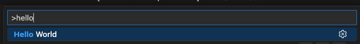

# Build Your Own VS Code extension and extend Code for i
## Prerequisites
### Tools
- VS Code
- node.js
- git

### Get the [boilerplate](https://github.com/sebjulliand/vscode-extension-template/tree/code4i)
- [Download the code4i template branch](https://github.com/sebjulliand/vscode-extension-template/archive/refs/heads/code4i.zip)
- Extract the zip file
- Rename the `vscode-extension-template-code4i` folder it contains to something that fits your project

### Initialize the project
- Open a terminal into the folder extracted above
- Run the following commands
```bash
git init --initial-branch=main
```
```bash
npm i
```

### Open the project in VS Code
- Press F5 to start a debug session
- In the debug window, press F1 and look for the Hello World command

- Press Enter
- A notification shows up and says Hello: success!

## Step 1: implement a simple "Run CL Command" command
## Step 2: add an action in the Object Browser and use CustomUI to display things
## Step 3: add another action in the Object Browser and create a submenu
## Step 4: create a simple spooled files browser using `vscode.window` API
## Step 5: create a Job browser using VS Code Tree View API 